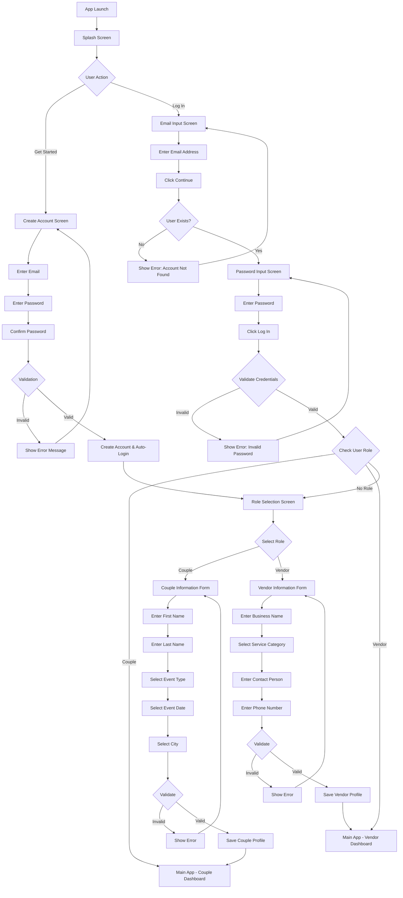

# Role-Based Registration Flow - Implementation Complete

> **📝 Document Updated:** October 26, 2025  
> **Note:** This document has been updated to reflect the current architecture after auth screens separation. The Create Account functionality is now in a dedicated `CreateAccountScreen.tsx` file (not in `LoginScreen.tsx`).

## Overview
Successfully implemented a simplified, role-based registration flow that removes the "Full Name" field from initial account creation and introduces a role selection step for Couples and Vendors.

The flow follows clean separation of concerns with dedicated screens for each authentication step (Splash → Onboarding → Create Account/Login → Role Selection → Profile Setup).

## Changes Implemented

### 1. CreateAccountScreen.tsx - Simplified Registration Form ✅
**File:** `apps/mobile/src/screens/CreateAccountScreen.tsx`

#### Create Account Form Fields:
- **Email Address** - Required, validated
- **Password** - Required, with strength indicator
- **Confirm Password** - Required, must match password

#### Features:
- **Password Strength Indicator** with dynamic color progression:
  - Red (Very Weak) → Orange (Weak) → Amber (Fair) → Green (Strong)
  - Progressive bar filling based on password complexity
  - Real-time feedback as user types

- **`handleSignUp` function**:
  - Validates email format
  - Validates password requirements
  - Validates password confirmation match
  - **Does NOT login immediately** - passes credentials forward as navigation params
  - Navigates to `RoleSelectionScreen` with `{ email, password, isNewUser: true }`
  - User completes registration flow before authentication

- **Multi-language support** (English/Swahili)
- **Terms of Service & Privacy Policy** links in footer
- **"Already have an account? Log In"** link to LoginScreen

### 2. RoleSelectionScreen.tsx - Passes Credentials Forward ✅
**File:** `apps/mobile/src/screens/RoleSelectionScreen.tsx`

#### Features:
- **Receives registration data** from CreateAccountScreen via navigation params
- Two role options only: **Couple** and **Vendor** (no Guest option)
- Beautiful card-based UI with gradients and icons
- **Passes credentials forward** when navigating:
  - Couples → `ProfileSetupScreen` with `{ ...registrationData, role: 'COUPLE' }`
  - Vendors → `VendorProfileSetup` with `{ ...registrationData, role: 'VENDOR' }`
- User still NOT authenticated at this stage

### 3. ProfileSetupScreen.tsx - Final Step & Login ✅
**File:** `apps/mobile/src/screens/ProfileSetupScreen.tsx`

#### Features:
- **Receives registration data** including email, password, role, and isNewUser flag
- 4-step profile setup form for couples:
  1. First Name & Last Name
  2. Event Type selection
  3. Event Date (optional)
  4. City selection
- Progress indicator showing "Step X of 4"
- **`handleComplete` function**:
  - Saves profile data to backend (TODO)
  - **Only NOW calls `await login(email, password)`** if isNewUser is true
  - User is authenticated after full registration is complete
  - Navigates to main app (handled by AuthContext)

## User Flow After Implementation

```
Splash Screen
  ↓ (User clicks "Get Started")
Create Account Screen (CreateAccountScreen.tsx)
  - Email input (validated)
  - Password input (with strength indicator)
  - Confirm Password input (must match)
  - "Create Account" button
  ↓ (Navigate with credentials - NOT logged in yet)
Role Selection Screen
  - Choose: Couple OR Vendor
  - Beautiful gradient cards with icons
  - Tap to select and auto-navigate
  ↓ (Based on role selection - pass credentials forward)
  ├─→ Couple: ProfileSetupScreen
  │   - First Name, Last Name
  │   - Event Type (Wedding, Kitchen Party, Sendoff, Other)
  │   - Event Date
  │   - City
  │   ↓ (Complete Setup button - ONLY NOW user is logged in)
  │   Main App - Couple Dashboard
  │
  └─→ Vendor: VendorProfileSetup
      - Business Name
      - Service Category
      - Contact Person
      - Phone Number
      ↓ (Complete Setup button - ONLY NOW user is logged in)
      Main App - Vendor Dashboard
```

## Flow Diagram (Mermaid)



## Testing Checklist

- ✅ Create account with just email + password works
- ✅ After creating account, user is auto-logged in
- ✅ User is directed to role selection after account creation
- ✅ Only Couple and Vendor options are shown (no Guest)
- ✅ Tapping a role card auto-navigates to appropriate screen
- ✅ No linting errors
- ✅ Translations updated (English & Swahili)
- ⏳ Language switching on RoleSelectionScreen (future enhancement)

## Files in Role-Based Registration Flow

1. **`/Users/boris/thefesta/apps/mobile/src/screens/SplashScreen.tsx`**
   - Simple static splash with logo/branding
   - Auto-navigates to OnboardingScreen after 2.5s

2. **`/Users/boris/thefesta/apps/mobile/src/screens/OnboardingScreen.tsx`**
   - 4 intro slides showcasing app features
   - "Get Started" button → navigates to CreateAccountScreen
   - "Log In" button → navigates to LoginScreen

3. **`/Users/boris/thefesta/apps/mobile/src/screens/CreateAccountScreen.tsx`**
   - Simplified registration form (email + password only)
   - Password strength indicator with dynamic colors
   - Auto-login after successful registration
   - Navigates to RoleSelectionScreen

4. **`/Users/boris/thefesta/apps/mobile/src/screens/LoginScreen.tsx`**
   - Email and password login only
   - "Forgot Password?" link → ForgotPasswordScreen
   - "Create Account" link → CreateAccountScreen

5. **`/Users/boris/thefesta/apps/mobile/src/screens/RoleSelectionScreen.tsx`**
   - Two role options: Couple and Vendor (no Guest)
   - Beautiful card-based UI with gradients
   - Auto-navigation after role selection

6. **`/Users/boris/thefesta/apps/mobile/src/screens/ProfileSetupScreen.tsx`**
   - Couple-specific profile setup
   - Collects: First Name, Last Name, Event Type, Date, City

7. **`/Users/boris/thefesta/apps/mobile/src/screens/ForgotPasswordScreen.tsx`**
   - Password reset via email
   - Sends reset instructions

## Next Steps (Optional Enhancements)

1. **Add language support to RoleSelectionScreen** - Include EN/SW toggle and translations
2. **Implement ProfileSetupScreen translations** - Add Swahili support for couple profile setup
3. **Create/Update VendorProfileSetup screen** - Ensure it has vendor-specific fields
4. **Add form validation** to ProfileSetupScreen and VendorProfileSetup
5. **Implement actual authentication API** - Replace placeholder in `handleSignUp`

## Implementation Date
October 26, 2025

---

**Status:** ✅ Complete and Ready for Testing

